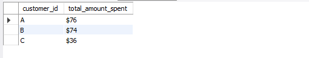
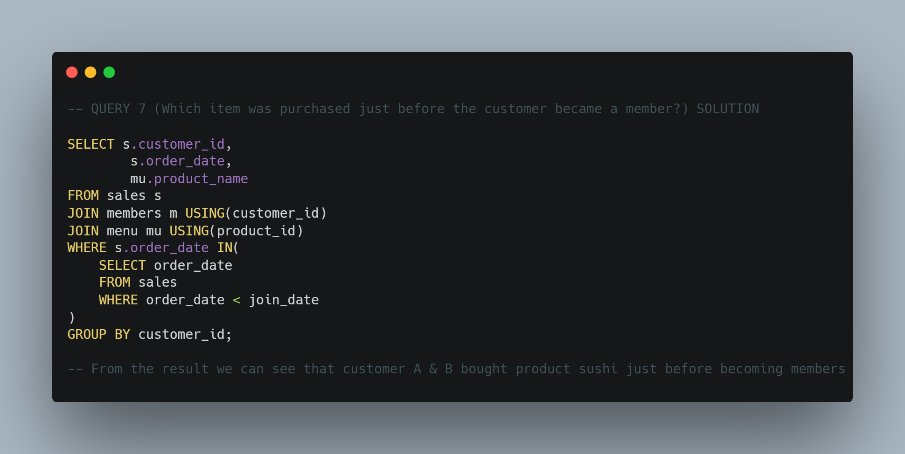

# Danny's Diner Case Study
## by Kola Ademola
___

___
## INTRODUCTION
___

I decided to take up the 8 weeks SQL challenge to improve my SQL skills aand this this project was just right for that;  
___Danny seriously loves Japanese food so in the beginning of 2021, he decides to embark upon a risky venture and opens up a cute little restaurant that sells his 3 favourite foods: sushi, curry and ramen.___

___Danny’s Diner is in need of your assistance to help the restaurant stay afloat - the restaurant has captured some very basic data from their few months of operation but have no idea how to use their data to help them run the business.___
___
## PROBLEM STATEMENT
___
Danny wants to use the data to answer a few simple questions about his customers, especially about their visiting patterns, how much money they’ve spent and also which menu items are their favourite. Having this deeper connection with his customers will help him deliver a better and more personalised experience for his loyal customers.

He plans on using these insights to help him decide whether he should expand the existing customer loyalty program - additionally he needs help to generate some basic datasets so his team can easily inspect the data without needing to use SQL.

Danny has provided you with a sample of his overall customer data due to privacy issues - but he hopes that these examples are enough for you to write fully functioning SQL queries to help him answer his questions!
### QUESTIONS
* What is the total amount each customer spent at the restaurant?
* How many days has each customer visited the restaurant?
* What was the first item from the menu purchased by each customer?
* What is the most purchased item on the menu and how many times was it purchased by all customers?
* Which item was the most popular for each customer?
* Which item was purchased first by the customer after they became a member?
* Which item was purchased just before the customer became a member?
* What is the total items and amount spent for each member before they became a member?
* If each $1 spent equates to 10 points and sushi has a 2x points multiplier - how many points would each customer have?
* In the first week after a customer joins the program (including their join date) they earn 2x points on all items, not just sushi - how many points do customer A and B have at the end of January?
___
## DATA SOURCING
The dataset for this project was gotten from **Danny MA's** [**8 WEEKS SQL CHALLENGE**](https://8weeksqlchallenge.com/case-study-1/)  
I used 3 key datasets for this case study:

### sales

### menu

### members

___
## DATA MODEL / ERD
___

This is a simple Star Schema.
___
## QUERIES / SOLUTIONS
* What is the total amount each customer spent at the restaurant?

___RESULT___  

___
* How many days has each customer visited the restaurant?

___RESULT___  

___
* What was the first item from the menu purchased by each customer?

___RESULT___  

___
* What is the most purchased item on the menu and how many times was it purchased by all customers?

___RESULT___  

___
* Which item was the most popular for each customer?

___RESULT___  

___
* Which item was purchased first by the customer after they became a member?

___RESULT___  

___
* Which item was purchased just before the customer became a member?

___RESULT___  

___
* What is the total items and amount spent for each member before they became a member?

___RESULT___  

___
* If each $1 spent equates to 10 points and sushi has a 2x points multiplier - how many points would each customer have?

___RESULT___  

___
* In the first week after a customer joins the program (including their join date) they earn 2x points on all items, not just sushi - how many points do customer A and B have at the end of January?

___RESULT___  

### Bonus Questions
### Join All The Things
The following questions are related creating basic data tables that Danny and his team can use to quickly derive insights without needing to join the underlying tables using SQL.

Recreate the following table output using the available data:  

___

___RESULT___  

___
### Rank All The Things
Danny also requires further information about the ranking of customer products, but he purposely does not need the ranking for non-member purchases so he expects null ranking values for the records when customers are not yet part of the loyalty program.  

___

___RESULT___  

___
