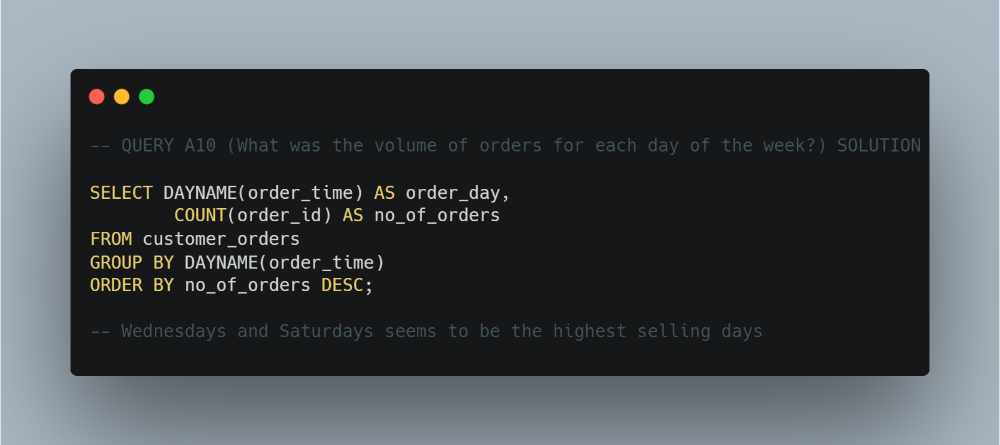
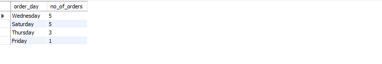
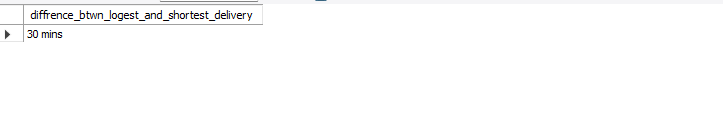
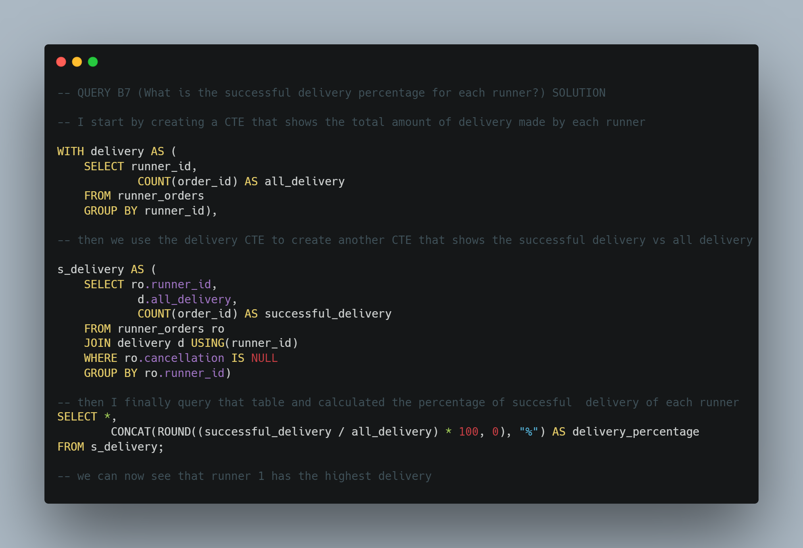

# PIZZA RUNNER Case Study
## by Kola Ademola
___

___
## INTRODUCTION
___

I decided to take up the 8 weeks SQL challenge to improve my SQL skills aand this this project was just right for that;  
___Did you know that over 115 million kilograms of pizza is consumed daily worldwide?(Well according to Wikipedia anyway…). Danny was scrolling through his Instagram feed when something really caught his eye “80s Retro Styling and Pizza Is The Future!”___
___Danny was sold on the idea, but he knew that pizza alone was not going to help him get seed funding to expand his new Pizza Empire so he had one more genius idea to combine with it he was going to Uberize it and so Pizza Runner was launched!___
___Danny started by recruiting “runners” to deliver fresh pizza from Pizza Runner Headquarters (otherwise known as Danny’s house) and also maxed out his credit card to pay freelance developers to build a mobile app to accept orders from customers.___

### PROBLEM STATEMENT
This case study has LOTS of questions - they are broken up by area of focus including:

* Pizza Metrics
* Runner and Customer Experience
* Ingredient Optimisation
* Pricing and Ratings
* Bonus DML Challenges (DML = Data Manipulation Language)
___
## DATA SOURCING 
___
The dataset for this challenge was gotten from the the [8 WEEKS SQL CHALLENGE](https://8weeksqlchallenge.com/case-study-2/), and it contains the following tables;  
### runers

### customer_orders

### runner_orders

### pizza_names

### pizza_recipes

### pizza_toppings

___
## QUERIES / SOLUTION
### A. Pizza Metrics
* How many pizzas were ordered?

___RESULT___  

___
* How many unique customer orders were made?

___RESULT___  

___
* How many successful orders were delivered by each runner?

___RESULT___  

___
* How many of each type of pizza was delivered?

___RESULT___  

___
* How many Vegetarian and Meatlovers were ordered by each customer?

___RESULT___  

___
* What was the maximum number of pizzas delivered in a single order?

___RESULT___  

___
For each customer, how many delivered pizzas had at least 1 change and how many had no changes?

___RESULT___  

___
* How many pizzas were delivered that had both exclusions and extras?

___RESULT___  

___
* What was the total volume of pizzas ordered for each hour of the day?

___RESULT___  

___
* What was the volume of orders for each day of the week?

___RESULT___  

___
### B. Runner and Customer Experience
* How many runners signed up for each 1 week period? (i.e. week starts 2021-01-01)

___RESULT___  

___
* What was the average time in minutes it took for each runner to arrive at the Pizza Runner HQ to pickup the order?

___RESULT___  

___
* Is there any relationship between the number of pizzas and how long the order takes to prepare?

___RESULT___  

___
* What was the average distance travelled for each customer?

___RESULT___  

___
* What was the difference between the longest and shortest delivery times for all orders?

___RESULT___  

___
* What was the average speed for each runner for each delivery and do you notice any trend for these values?

___RESULT___  

___
* What is the successful delivery percentage for each runner?

___RESULT___  

___
### C. Ingredient Optimisation
* What are the standard ingredients for each pizza?

___RESULT___  

___
* What was the most commonly added extra?

___RESULT___  

___
* What was the most common exclusion?

___RESULT___  

___
* Generate an order item for each record in the customers_orders table in the format of one of the following:
Meat Lovers
Meat Lovers - Exclude Beef
Meat Lovers - Extra Bacon
Meat Lovers - Exclude Cheese, Bacon - Extra Mushroom, Peppers

___RESULT___  

___
Generate an alphabetically ordered comma separated ingredient list for each pizza order from the customer_orders table and add a 2x in front of any relevant ingredients
For example: "Meat Lovers: 2xBacon, Beef, ... , Salami"

___RESULT___  

___
* What is the total quantity of each ingredient used in all delivered pizzas sorted by most frequent first?

___RESULT___  

___
### D. Pricing and Ratings
* If a Meat Lovers pizza costs $12 and Vegetarian costs $10 and there were no charges for changes - how much money has Pizza Runner made so far if there are no delivery fees?

___RESULT___  

___
* What if there was an additional $1 charge for any pizza extras?
Add cheese is $1 extra

___RESULT___  

___
* The Pizza Runner team now wants to add an additional ratings system that allows customers to rate their runner, how would you design an additional table for this new dataset - generate a schema for this new table and insert your own data for ratings for each successful customer order between 1 to 5.

___RESULT___  

___
* Using your newly generated table - can you join all of the information together to form a table which has the following information for successful deliveries?
customer_id
order_id
runner_id
rating
order_time
pickup_time
Time between order and pickup
Delivery duration
Average speed
Total number of pizzas

___RESULT___  

___
* If a Meat Lovers pizza was $12 and Vegetarian $10 fixed prices with no cost for extras and each runner is paid $0.30 per kilometre traveled - how much money does Pizza Runner have left over after these deliveries?

___RESULT___  

___
### E. Bonus Questions
If Danny wants to expand his range of pizzas - how would this impact the existing data design? Write an INSERT statement to demonstrate what would happen if a new Supreme pizza with all the toppings was added to the Pizza Runner menu?
